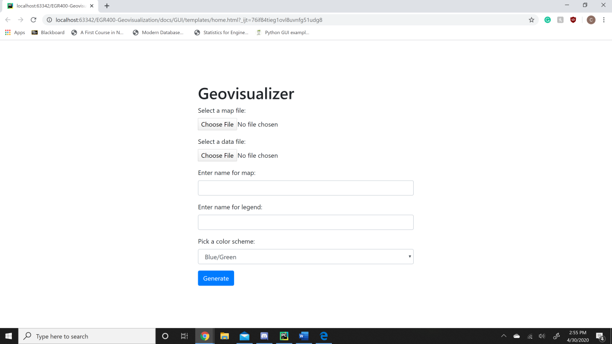

```diff
+ April 30: Released v1.0.0 with
+   functionality for image geovisualization, data plotting   
```

# Geovisualization Documentation
Welcome to the introduction guide to **Asyncing Ship's Geovisualization program**. This documentation will help you get started with the set up process in order to use the program and show you how to implement geovisualization tools so that you can plot maps of different geographic regions and areas.


## Description
This program was designed to allow users to develop interactive chloropleth maps that utilize a GeoJSON file for reading the data and either .JSON or .CSV files in order to plot points and import data sets that will change the visual appearance of the map while creating an interactive UI for data science and software applications. The program enables users to load in two different files: 1. The data file that will generate the map's location (**GeoJSON**) & 2. The data file that holds the data that is to be plotted (**.JSON or .CSV**). Once these files are uploaded within the construct users can initialize their maps with a starting location, zoom values, as well as parameters that entail what geographic data is going to be used like the color, title of the map, legend name, etc. This is all completed with the Flask web API. The program receives the input from the user and the files are sent back as a post request and the program uses it to generate the contents of the map itself. 
 

<p align="center">

</p>

### Tools & Technologies:  
PyCharm, mongoDB, Docker, Flask, Folium & Leaflet.js

### Programming Languages:
Python, Node.js


## Table of Contents
1. [Getting Started](https://github.com/Daechathon/EGR400-Geovisualization/blob/Documentation/README.md#getting-started)
   - [*System Requirements*](https://github.com/Daechathon/EGR400-Geovisualization/blob/Documentation/README.md#system-requirements)
   - [*Prerequistite Installation*](https://github.com/Daechathon/EGR400-Geovisualization/blob/Documentation/README.md#prerequisite-installation)
   - [*Coding*](https://github.com/Daechathon/EGR400-Geovisualization/blob/Documentation/README.md#coding)
   - [*Flask API*](https://github.com/Daechathon/EGR400-Geovisualization/blob/Documentation/README.md#flask-api)
2. [Input/Output Verification](https://github.com/Daechathon/EGR400-Geovisualization/blob/Documentation/README.md#inputoutput-verification)
   - [*Examples Input/Output*](https://github.com/Daechathon/EGR400-Geovisualization/blob/Documentation/README.md#examples-inputoutput)
3. [UI Support](https://github.com/Daechathon/EGR400-Geovisualization/blob/Documentation/README.md#ui-support)
4. [Contributors](https://github.com/Daechathon/EGR400-Geovisualization/blob/Documentation/README.md#contributors)


## Getting Started
These instructions will show you how to produce a copy of the project while also getting it up and running on your local machine for development and testing purposes.

### System Requirements 

__Requirements__

* A machine running Linux or Windows
* Anaconda with Python version >= 3.8.2
* Folium package
* Flask API
> NOTE: Folium is Python library that helps create several types of Leaflet maps

### Prerequisite Installation
1. Download and Install the latest version of [Anaconda](https://www.anaconda.com/distribution/) with Python >= 3.8.2

   or

   Pip install and run Pandas in Python
   ```
   $ pip install pandas
   ```
2. Pip Install [Folium](https://pypi.org/project/folium/)

   ```
   $ pip install folium
   ```   
   or
   ```   
   $ conda install -c conda-forge folium
   ```
3. Pip Install [Flask API](https://www.flaskapi.org/)

   ```
   $ pip install Flask-API
   ```
   
> NOTE: For Windows users it is suggested that you use Anaconda

> NOTE: For non-Windows you can easily install a python package manager, like pip, through Homebrew or use the apt-get command if you are using Linux

### Coding

__Coding Your Project__

A step by step series of examples that tell you how to get a Geovisualization program running

1. Upload your map using a GeoJSON format

   ```
   # provide absolute paths for GeoJSON from local machine
   json_path = '../data/GeoJSON/us_states.json'
   ```
> NOTE: An example of this file type can be located [here](https://github.com/Daechathon/EGR400-Geovisualization/tree/Development/data/GeoJSON)

2. Upload the data sets you want to map from various file types

   ```
   # provide absolute paths for dataset from local machine
   dataset1_path = '../data/Datasets/us_death_rates.csv'
   dataset2_path = '../data/Datasets/covid-19_cases.json'
   ```
> NOTE: The application currently takes in .csv and .json files (Examples can be found [here](https://github.com/Daechathon/EGR400-Geovisualization/tree/Development/data/Datasets))

> NOTE: Only takes two columns or keys with data


3. Upon running the application it will then generate your desired map with plotted data for spatial vectors and statistical data
**See Example Code "Map Generation"**
> NOTE: Generates an html which displays the user's map of choice

4. Map is saved to HTML

   ```
   # code block
   # Save to html
    m.save(html)
    first_path = os.path.abspath('./' + html)
    new_path = os.path.abspath('./templates/')
    shutil.move(first_path, new_path + '/' + html)
    return html
   ```
> NOTE: Could also be generated in browser with localhost


__Example Code: Files to Import__

To begin writing your file first import Pandas and Folium
   ```
   # code block
   import pandas as pd
   import folium as f
   import os
   import pathlib
   import shutil
   ```

__Example Code: Map Generation__

This function takes in the data sets of various file formats to generate a chloropleth map and plot the given data
   ```
   # code block
   def generate_map(geo_file, data_file, col, color, legend, html):
       geo_path = os.path.join(geo_file)
       data_path = os.path.join(data_file)
       data_read = ''
   ```
> NOTE: "geo_file" & "data_file" are the spaces where your .csv and .json files are placed

This reads in the file type 
   ```
   # code block
       ext = pathlib.Path(data_path).suffix
       if ext == ".csv":
           data_read = pd.read_csv(data_path)
       elif ext == ".json":
           data_read = pd.read_json(data_path)
   ```

Here lies the visual aspect within your generated map, which showcases your inputted data by color and layout plotting
   ```
   # code block
       m = f.Map(location=[37, -102], zoom_start=5)

       # Add the color for the chloropleth:
       m.choropleth(
           geo_data=geo_path,
           name='choropleth',
           data=data_read,
           columns=col,
           key_on='feature.id',
           fill_color=color,
           fill_opacity=0.7,
           line_opacity=0.2,
           legend_name=legend
       )
       f.LayerControl().add_to(m)
   ```
### Flask API

__Working API: Home Page__

Web application home page 
   ```
   # code block
       @app.route('/', methods=['GET'])
       def home():
           os.makedirs(os.path.abspath(MAP_FOLDER), exist_ok=True)
           os.makedirs(os.path.abspath(DATA_FOLDER), exist_ok=True)
           return render_template("home.html")


       def allowed_file(filename):
           return '.' in filename and \
                  filename.rsplit('.', 1)[1].lower() in ALLOWED_EXTENSIONS

   ```

__Working API: Map Generation__

Here we have the beginning of our map generation that allows the program to be made into a online application. Files are put into folders as data is taken in
   ```
   # code block
       @app.route('/generateMap', methods=['GET', 'POST'])
       def upload_file():
           try:
               os.makedirs(os.path.abspath(MAP_FOLDER), exist_ok=True)
               os.makedirs(os.path.abspath(DATA_FOLDER), exist_ok=True)
               if request.method == 'POST':
                   # check if the post request has the file par
                   map_file = escape(request.files['mapfile'])
                   data_file = escape(request.files['datafile'])
                   map_name = escape(request.form.get('mapname'))
                   legend_name = escape(request.form.get('legendname'))
                   color = escape(request.form.get('color'))
                   if map_file.filename == "" or data_file.filename == "" or map_name != '' or legend_name != '':
                       flash('No file part')
                       return redirect(url_for('home'))
   ```
This code redirects and requests users to input correct files if they have entered invalid or no file. The program checks the name of files making sure that .json and .csv files are again being loaded correctly.
   ```
   # code block
            # if user does not select file, browser also
            # submit an empty part without filename
            if map_file.filename == '':
                flash('No selected file')
                return redirect(request.url)
            if map_file and allowed_file(map_file.filename):
                file_suffix = pb.Path(map_file.filename).suffix
                map_file_name = secure_filename(map_name + 'MAP' + file_suffix)
                map_file.save(os.path.join(app.config['GeoJSON'], map_file_name))

            if data_file.filename == '':
                flash('No selected file')
                return redirect(request.url)
            if data_file and allowed_file(data_file.filename):
                file_suffix = pb.Path(data_file.filename).suffix
                data_file_name = secure_filename(map_name + 'DATASET' + file_suffix)

                data_file.save(os.path.join(app.config['Datasets'], data_file_name))

            if map_name != '' and legend_name != '' and color != '' and allowed_file(
                    map_file.filename) and allowed_file(data_file.filename):

                data_path = os.path.join(app.config['Datasets'], data_file_name)
                map_path = os.path.join(app.config['GeoJSON'], map_file_name)

                suffix = pb.Path(data_path).suffix

                if suffix == ".csv":
                    col = pd.read_csv(data_path).count(0).keys()
                else:
                    col = pd.read_json(data_path).count(0).keys()
                return render_template(m.generate_map(geo_file=map_path, data_file=data_path, color=color,
                                                      col=col.to_list(), html=map_name + '.html', legend=legend_name))
            return redirect(url_for('home'))
            
      app.run() 
   ```
   

## Input/Output Verification

### Examples Input/Output

__Testing__
<p align="left">

</p>

<p align="left">

</p>

## UI Support
The generated chloropleth map you have created will appear and is opened through a new tab that holds the HTML file displaying the map

## Contributors
* Brandon Aldridge-*Testing/Deployment*
* Cameron Warren-*Design*
* Chase Crossley-*Deployment/Development*
* Jacob Nona-*Deployment/Development*
* Micah Robinson-*Documentation*
